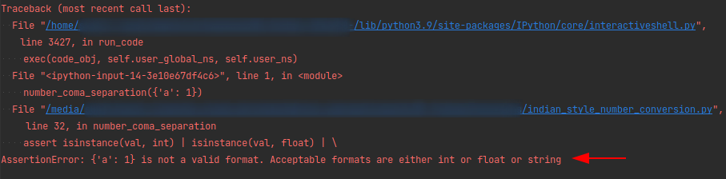
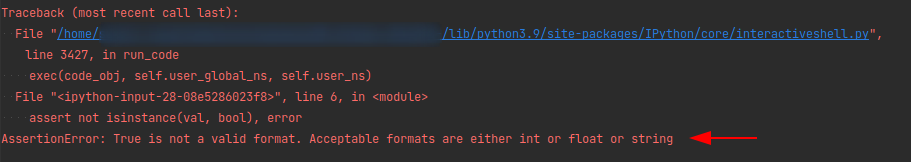

# Thousand separator - Indian numbering format

India follows a different style of thousand separator. This script converts a number into Indian style thousand coma separated value.

#### Example
- In Great Britain, 1 million pounds is written as 1,000,000
- In India, 1 million rupees in India is written as 10,00,000

The input can be a positive or negative value in any of the following format:
1. integer
2. float
3. string

### Use case 1
Working with single values.
```python
Usage                                   Outcome
===================================     ==========================

number_coma_separation(1234)            '1,2345'
number_coma_separation(2345.678)        '2,345.678'
number_coma_separation('3456.14')       '3,456.14'
number_coma_separation(-145.1256)       '-145.1256'
number_coma_separation(-789456)         '-7,89,456'
number_coma_separation('-456.321')      '-456.321'
```

### Use case 2
Instead of single values, to use this function with pandas series or 
dataframes, use the .apply() function as show below.

```python
import pandas as pd

# Creating a sample dataframe to work with:

df = pd.DataFrame({'category': ['a', 'b', 'c', 'd', 'e'],
                   'amount': [1234, 14456.78, -357426, '78945.6521', -14825.96]})
print(df)

#   category      amount
#          a        1234
#          b    14456.78
#          c     -357426
#          d  78945.6521
#          e   -14825.96

# Formatting the values in column 'amount' to India style and 
# saving the outcomes to a new column 'amount_formatted' 

df['amount_formatted'] = df['amount'].apply(number_coma_separation)
print(df)

#   category      amount amount_formatted
#          a        1234            1,234
#          b    14456.78        14,456.78
#          c     -357426        -3,57,426
#          d  78945.6521      78,945.6521
#          e   -14825.96       -14,825.96
```

### Use case 3
If the value passed to the function is of any other data type except integer or 
string or float, the function will notify the user that the value is not of 
an acceptable data type.

```python
# Passing a dict data type
number_coma_separation({'a': 1})
```


```python
# Passing a boolean data type
number_coma_separation(True)
```


